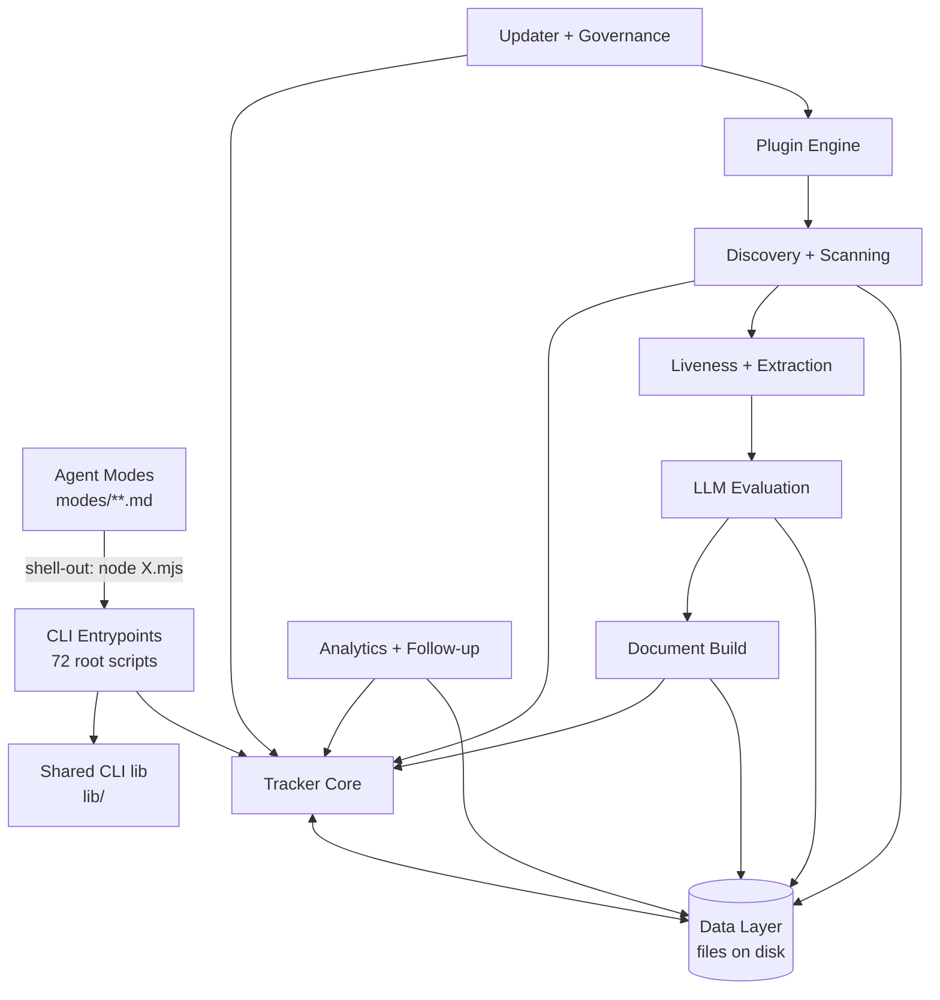
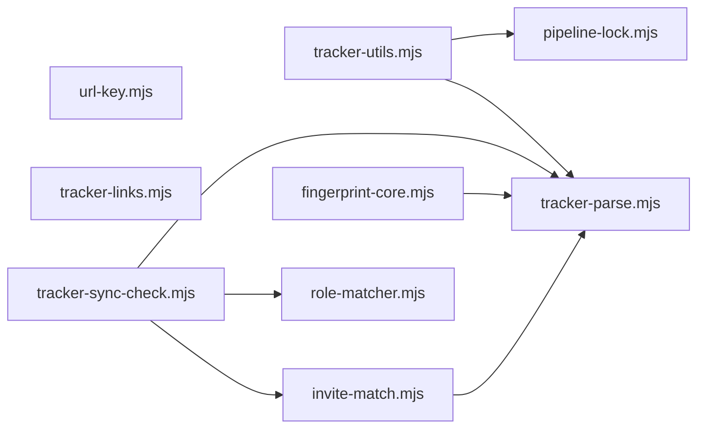
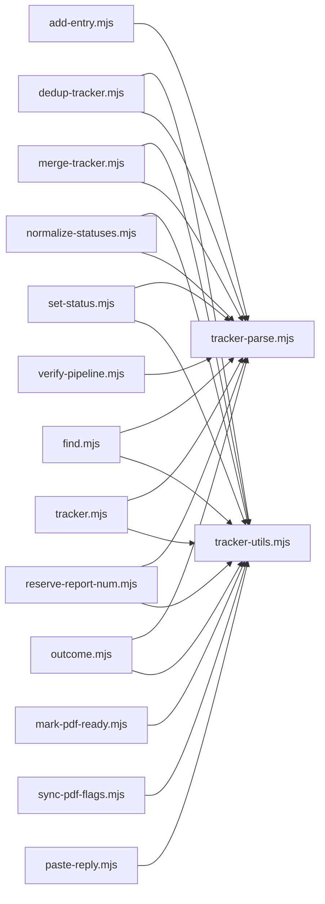
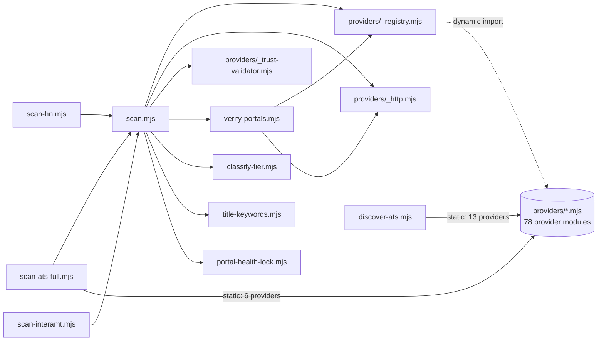
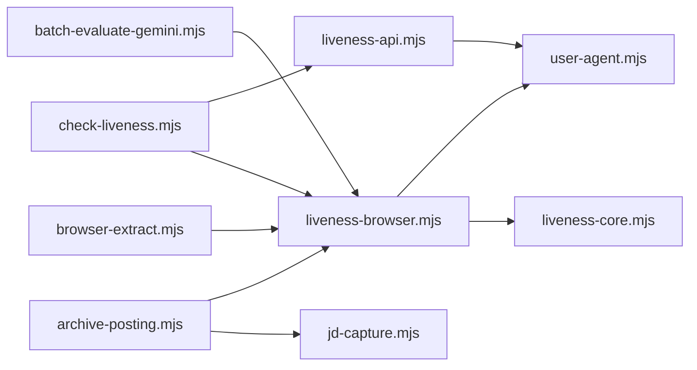
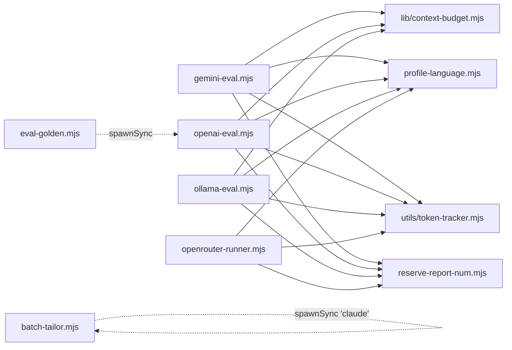
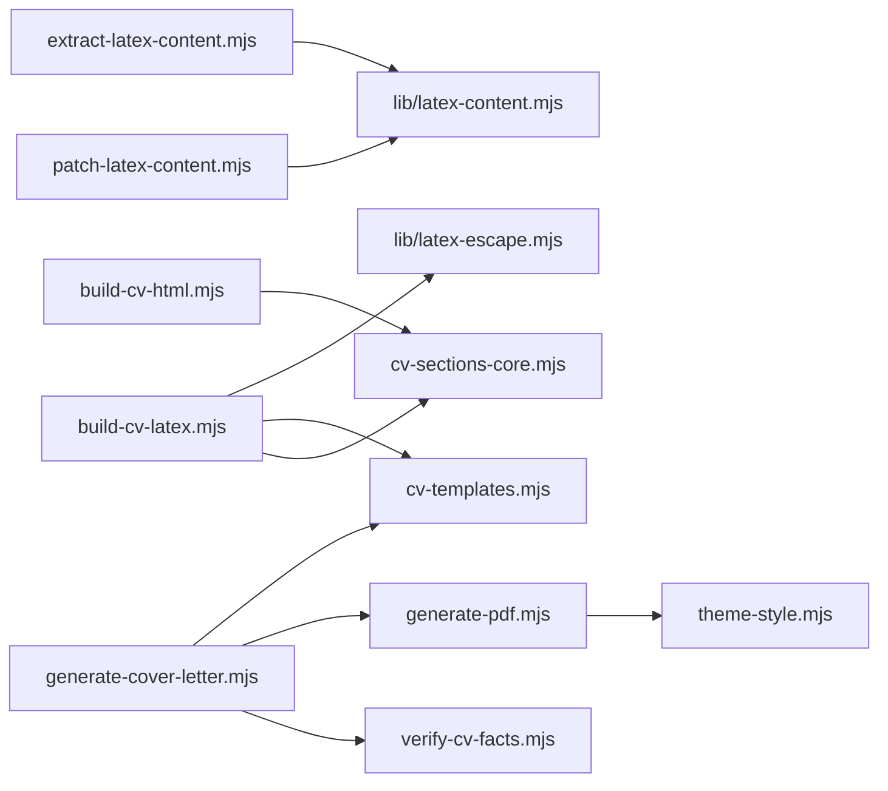
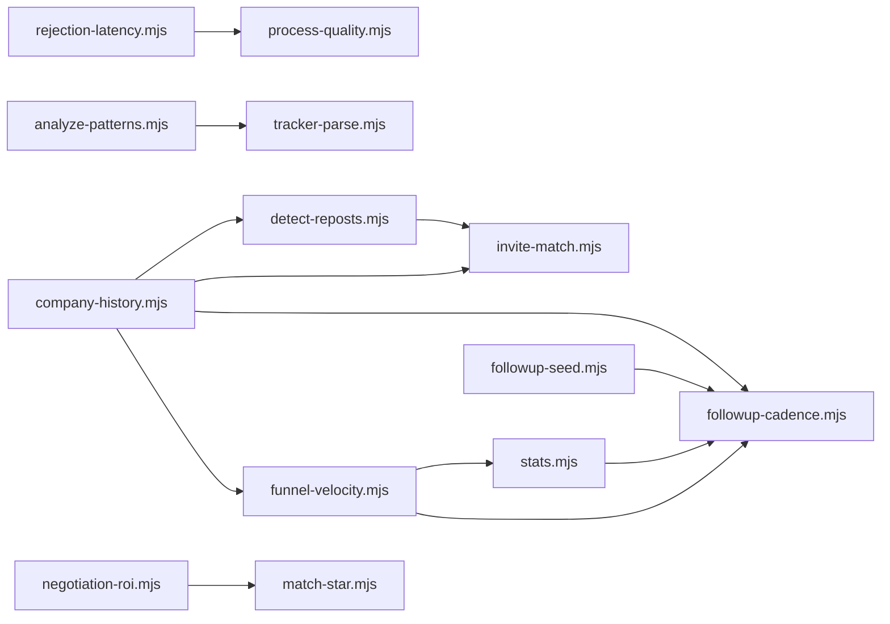
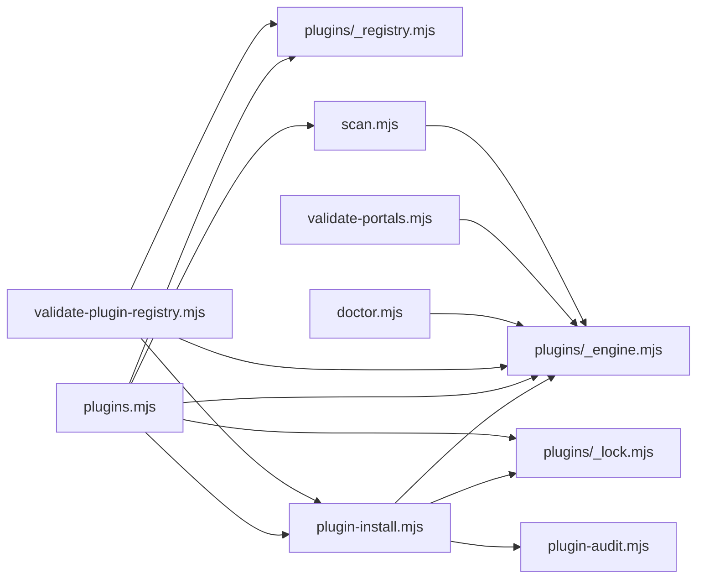
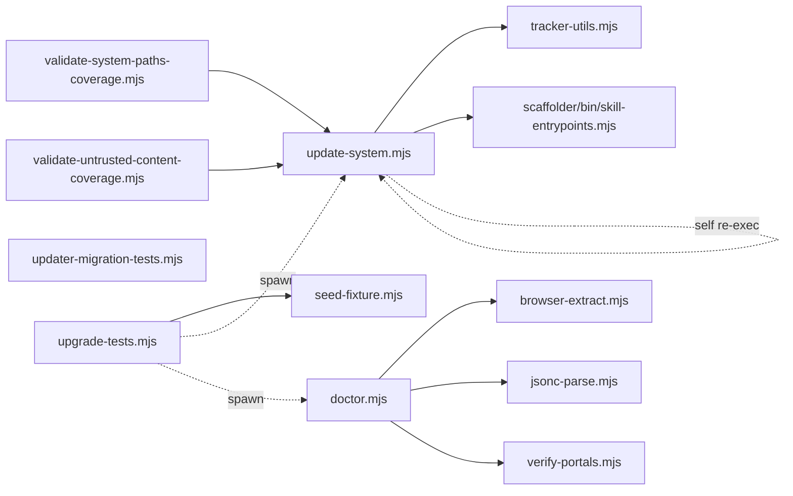

# career-ops — Dependency Graph (audit)

Scope: static ESM import edges + implicit edges (shared data files, shell-outs,
`modes/*.md` invocations). All edges below were extracted from source, not
inferred from filenames.

Method: a Node one-liner over every `.mjs` in the repo, matching
`import … from '<rel>'`, bare `import '<rel>'`, and `import('<rel>')`; separately
`rg` for `execSync|execFileSync|spawnSync|spawn` and for data-path string
literals. Dynamic directory loading (`providers/_registry.mjs:24-51`) is
invisible to static extraction and is called out explicitly.

---

## 0. Headline numbers

| Measure | Value | Evidence |
|---|---|---|
| Root `.mjs` | 127 | `fd -t f -d 1 -e mjs` |
| `lib/*.mjs` | 9 | `lib/` listing |
| `providers/*.mjs` | 87 | `fd -t f -e mjs providers` |
| `tests/*.mjs` | 214 | `fd -t f -e mjs tests` |
| `web/**/*.mjs` | 62 | `fd -t f -e mjs web` |
| `plugins/**/*.mjs` | 12 | `fd -t f -e mjs plugins` |
| `utils/*.mjs` | 1 (`utils/token-tracker.mjs`) | `ls utils/` |
| `scripts/*.mjs` | 1 (`scripts/check-syntax.mjs`) | `ls scripts/` |
| Root scripts importing `lib/` | **39** (exact) | see §4 |
| Root scripts with **zero** in-degree (entrypoints/tests) | **72** | see §5 |
| Root scripts imported by ≥1 other file | **55** | 127 − 72 |
| Highest in-degree module | `tracker-parse.mjs` (27) | see §5 |

---

## 1. Overview — components only



The only cycle-free spine is `DATA`. Every component both reads and writes the
file layer; that is the real integration bus, not the import graph.

---

## 2. Component diagrams

### 2.1 Tracker Core — modules



`tracker-parse.mjs` (in-degree 27) and `tracker-utils.mjs` (26) are the two real
deep modules in the repo. `tracker-utils.mjs` is the only module that layers on
`pipeline-lock.mjs` for tracker writes (`tracker-utils.mjs:206`, `:284`, `:474`).

### 2.2 Tracker Core — CLIs on top of it



Additional edges not shown to keep the diagram readable:
`merge-tracker.mjs` → `tracker-links.mjs`, `role-matcher.mjs`, `find.mjs`,
`url-key.mjs`; `outcome.mjs` → `role-matcher.mjs`, `find.mjs`,
`jd-capture.mjs`; `find.mjs` → `role-matcher.mjs`;
`verify-pipeline.mjs` → `tracker-sync-check.mjs`, `stats.mjs`;
`reconcile-pipeline.mjs` → `tracker-links.mjs`.

### 2.3 Discovery + Scanning



Two findings here:

1. `providers/_registry.mjs:24-51` loads providers by `readdirSync` +
   `await import(...)`. **No static edge exists** from the registry to any of the
   78 provider modules; any import-graph tool will report them as orphans. They
   are not.
2. `discover-ats.mjs` bypasses the registry entirely and statically imports 13
   providers by name (`greenhouse, ashby, lever, workday, workable,
   smartrecruiters, recruitee, breezy, bamboohr, pinpoint, rippling, join`),
   and `scan-ats-full.mjs` statically imports 6 more (`greenhouse, lever, ashby,
   workday, icims`). That is a second, hardcoded routing table sitting beside the
   dynamic one — the registry's own header comment
   (`providers/_registry.mjs:5-8`) says it was extracted so callers would stop
   doing exactly this.

### 2.4 Liveness + Extraction



`liveness-browser.mjs` in-degree 6; `user-agent.mjs` in-degree 6 — both
undocumented in `README.md`/`ARCHITECTURE.md`, both genuinely shared.

### 2.5 LLM Evaluation



`gemini-eval.mjs`, `openai-eval.mjs`, `ollama-eval.mjs` import the **identical
four-module set**. `openrouter-runner.mjs` imports three of the four (no
`lib/context-budget.mjs`) and adds `user-agent.mjs` + `title-keywords.mjs`.
That is the clearest four-way near-duplicate cluster in the repo, and the
divergence (one of four skipping the token budgeter) is itself suspicious.

Shell-out edges: `eval-golden.mjs:155-157` spawns
`openai-eval.mjs --file … --model … --no-save`;
`batch-tailor.mjs:130` spawns the external `claude` binary.

### 2.6 Document Build



`generate-latex.mjs` and `img-to-pdf.mjs` have **zero local imports and zero
in-degree** — fully standalone despite sitting in this cluster.

### 2.7 Analytics + Follow-up



`company-history.mjs` is the fan-in hub: it imports 7 local modules
(`detect-reposts, invite-match, tracker-utils, tracker-parse,
lib/local-today, followup-cadence, funnel-velocity`).

`salary-gap.mjs`, `weekly-digest.mjs`, `assessment-log.mjs`,
`check-table-freshness.mjs` are analytics leaves with no local imports beyond
`lib/`.

### 2.8 Plugins



### 2.9 Updater + Governance



`update-system.mjs` is the second-highest in-degree root script (11), but 9 of
those are the `lib/` path strings in its `SYSTEM_PATHS` array
(`update-system.mjs:153-164`) — **string references, not imports**. Its only
real code imports are `tracker-utils.mjs` and `scaffolder/bin/skill-entrypoints.mjs`.
`update-system.mjs:1622` re-execs itself (`update-system.mjs apply`).

---

## 3. Implicit edges — the file layer

Static imports understate coupling badly. These are the shared-file edges,
counted by string-literal references in root `.mjs` files.

| Data file | Root `.mjs` touching it | Note |
|---|---|---|
| `config/profile.yml` | **30** | the widest coupling in the repo |
| `data/applications.md` (+ `CAREER_OPS_TRACKER`) | **40** | mostly mediated by `tracker-parse`/`tracker-utils` |
| `reports/` | 36 | |
| `data/scan-history.tsv` | 17 | |
| `data/pipeline.md` | 15 | lock-mediated via `pipeline-lock.mjs` |
| `jds/` | 12 | |
| `data/follow-ups.md` | 11 | |
| `data/active-interviews.md` | 5 | `verify-pipeline, tracker-sync-check, rejection-latency, process-quality` (+1 test) |
| `data/blacklist.md` | 4 | `test-all, scan, scan-ats-full, rejection-latency` |

### Tracker-path resolution is forked

`tracker-utils.mjs:109` exports `resolveTrackerPath(rootDir)`. 14 files call it.
Three production scripts re-derive the same thing inline and **do not agree**:

- `find.mjs:165` — `process.env.CAREER_OPS_TRACKER || resolve(ROOT,'data','applications.md')` (absolute)
- `tracker.mjs:47` — `process.env.CAREER_OPS_TRACKER || 'data/applications.md'` (relative — cwd-dependent)
- `verify-pipeline.mjs:36-37` — its own ternary

Confidence: high (all three read directly).

### Raw tracker reads that bypass the parse layer

Files that import `tracker-parse`/`tracker-utils` **and still** do their own
`readFileSync` on the tracker: `analyze-patterns.mjs`, `dedup-tracker.mjs`,
`followup-cadence.mjs`, `mark-pdf-ready.mjs`, `merge-tracker.mjs`,
`normalize-statuses.mjs`, `set-status.mjs`, `upskill.mjs`, `verify-pipeline.mjs`.
`seed-fixture.mjs` reads it raw with no tracker import at all.
Confidence: medium-high (regex `readFileSync\([^)]*(TRACKER|APPS|applications\.md)`;
a variable-indirected read would be missed).

### Production shell-outs (non-test)

| From | To | Site |
|---|---|---|
| `reply-watch.mjs` | `node tracker.mjs sync` | `reply-watch.mjs:329` |
| `invite-match.mjs` | `set-status.mjs <n> Rejected --json` | `invite-match.mjs:726-731` |
| `eval-golden.mjs` | `openai-eval.mjs --file …` | `eval-golden.mjs:155-157` |
| `update-system.mjs` | itself (`apply`) | `update-system.mjs:1622` |
| `update-system.mjs` | `go build`, `npm install`, `npx playwright install` | `:1257`, `:1966`, `:1973` |
| `rank-pipeline.mjs` | configured external CLI binary | `rank-pipeline.mjs:237` |
| `batch-tailor.mjs` | `claude` | `batch-tailor.mjs:130` |
| `manifesto.mjs` | OS page opener | `manifesto.mjs:27` |

### `modes/**.md` → script edges

42 distinct scripts are invoked from `modes/`. Full per-file listing is in the
recon brief and is unchanged by this pass. The shape that matters: 18 language
subtrees each re-invoke a near-identical subset
(`browser-extract, cv-sync-check, reserve-report-num, set-status,
generate-pdf`), and the translations have **drifted** — `modes/nl/pipeline.md`
invokes 7 scripts where `modes/zh/pipeline.md` invokes 2.

---

## 4. Root scripts importing `lib/` — all 39, with symbols

Exact count: **39** distinct root `.mjs` files (matches the stated baseline).

### By `lib/` module

| lib module | LOC | Root importers |
|---|---|---|
| `lib/cli-flags.mjs` | 148 | **27** |
| `lib/local-today.mjs` | 30 | **9** |
| `lib/context-budget.mjs` | 367 | 3 |
| `lib/latex-content.mjs` | 364 | 2 |
| `lib/ascii-fold.mjs` | 78 | 1 root (`verify-portals.mjs`) + `providers/_trust-validator.mjs` |
| `lib/gemini-node-floor.mjs` | 56 | 1 (`doctor.mjs`) |
| `lib/latex-escape.mjs` | 70 | 1 (`build-cv-latex.mjs`) |
| `lib/golden-budget-analysis.mjs` | 245 | **0** — see below |
| `lib/context-budget.test.mjs` | 345 | (test) |

### Per-script

| Root script | lib module | Symbols |
|---|---|---|
| `add-entry.mjs` | cli-flags | `validateFlags` |
| `archive-posting.mjs` | cli-flags | `validateFlags` |
| `assessment-log.mjs` | local-today | `localToday` |
| `batch-tailor.mjs` | cli-flags | `flagValue, hasFlag, validateFlags` |
| `browser-extract.mjs` | cli-flags | `flagValue, hasFlag, validateFlags` |
| `build-cv-latex.mjs` | latex-escape | `escapeLatex, sanitizeUrl` |
| `check-table-freshness.mjs` | cli-flags; local-today | `flagValue, validateFlags`; `localToday` |
| `classify-tier.mjs` | cli-flags | `validateFlags` |
| `company-history.mjs` | local-today | `localToday` |
| `contacts.mjs` | cli-flags | `validateFlags, hasFlag, flagValue` |
| `dedup-tracker.mjs` | cli-flags | `validateFlags` |
| `detect-reposts.mjs` | cli-flags | `flagValue, validateFlags` |
| `doctor.mjs` | cli-flags; gemini-node-floor | `validateFlags`; `geminiNodeFloor` |
| `extract-latex-content.mjs` | latex-content | `buildManifest` |
| `fix-slugs.mjs` | cli-flags | `flagValue, hasFlag, validateFlags` |
| `followup-cadence.mjs` | local-today; cli-flags | `localToday`; `flagValue, validateFlags` |
| `followup-seed.mjs` | local-today | `localToday` |
| `funnel-velocity.mjs` | cli-flags; local-today | `flagValue, validateFlags`; `localToday` |
| `gemini-eval.mjs` | context-budget | `buildBudgetedPrompt` |
| `invite-match.mjs` | cli-flags | `validateFlags` |
| `negotiation-roi.mjs` | cli-flags | `flagValue, hasFlag` |
| `ollama-eval.mjs` | context-budget | `buildBudgetedPrompt` |
| `openai-eval.mjs` | context-budget | `buildBudgetedPrompt` |
| `patch-latex-content.mjs` | latex-content | `applyPatches` |
| `process-quality.mjs` | cli-flags | `flagValue, validateFlags` |
| `rank-pipeline.mjs` | cli-flags | `flagValue, hasFlag` |
| `rejection-latency.mjs` | cli-flags | `flagValue, hasFlag, validateFlags` |
| `reply-watch.mjs` | cli-flags | `validateFlags` |
| `scan-ats-full.mjs` | cli-flags | `validateFlags` |
| `scan.mjs` | cli-flags; local-today | `flagValue, hasFlag, validateFlags`; `localToday` |
| `set-status-tests.mjs` | local-today | `localToday` |
| `set-status.mjs` | local-today | `localToday` |
| `stats.mjs` | cli-flags | `validateFlags` |
| `story-provenance-check.mjs` | cli-flags | `flagValue` |
| `test-all.mjs` | cli-flags | `flagValue, hasFlag` |
| `upskill.mjs` | cli-flags | `validateFlags` |
| `validate-portals.mjs` | cli-flags | `flagValue, hasFlag` |
| `verify-portals.mjs` | ascii-fold | `asciiFold` |
| `weekly-digest.mjs` | cli-flags | `validateFlags` |

Only **three symbols** (`validateFlags`, `flagValue`, `hasFlag`) account for 27
of the 39 edges. `lib/` is, in practice, an argv-parsing helper plus six
single-consumer modules.

`lib/golden-budget-analysis.mjs` (245 LOC) has **zero importers repo-wide**. Its
only references are its own header and `update-system.mjs:164`. It is a
standalone CLI (`node lib/golden-budget-analysis.mjs`, `lib/golden-budget-analysis.mjs:15`)
living in a directory the docs never mention.

---

## 5. In-degree

**Top imported modules** (repo-wide static in-degree, root scripts only):

```
27  tracker-parse.mjs        6  liveness-browser.mjs     4  cv-sections-core.mjs
26  tracker-utils.mjs        6  role-matcher.mjs         4  portal-health-lock.mjs
13  scan.mjs                 6  user-agent.mjs           4  title-keywords.mjs
11  pipeline-lock.mjs        5  generate-cover-letter.mjs 3 detect-reposts.mjs
11  update-system.mjs*       5  generate-pdf.mjs         3  verify-cv-facts.mjs
 7  cv-templates.mjs         5  invite-match.mjs
 6  followup-cadence.mjs     5  profile-language.mjs
                             5  reserve-report-num.mjs
```
\* 9 of 11 are `SYSTEM_PATHS` string literals, not imports.

**Zero in-degree — 72 root scripts.** These are entrypoints (CLIs, test
runners, configs). Not orphans by themselves; orphan status requires cross-checking
against `package.json`, `modes/`, and docs, which the recon brief covers.

```
agent-inbox-tests agent-inbox analyze-patterns application-answers archive-posting
assessment-log batch-tailor build-cv-html build-cv-latex build-dashboard
check-liveness company-funded company-history.test contacts.test cv-sync-check
dedup-tracker detect-reposts.test discover-ats.test doctor eval-golden
extract-latex-content fix-slugs followup-cadence.test followup-seed-tests
gemini-eval generate-latex img-to-pdf intake invite-match.test jd-similarity.test
jd-skill-gap manifesto mark-pdf-ready merge-tracker negotiation-roi
normalize-statuses ollama-eval openai-eval openai-tailor outcome
paste-reply-tests paste-reply patch-latex-content playwright.cv.config plugins
prepare-application process-quality.test rank-pipeline reconcile-pipeline
rejection-latency reply-matcher.test reply-watch salary-gap scan-ats-full
scan-interamt set-status-tests set-status story-provenance-check sync-pdf-flags
test-all test-salary-filter test-trust-validator tracker-columns-tests
tracker-writer-lock-tests updater-migration-tests upgrade-tests
validate-plugin-registry validate-portals validate-system-paths-coverage
validate-untrusted-content-coverage verify-pipeline weekly-digest
```

Genuinely isolated (no local imports **and** no in-degree):
`generate-latex.mjs`, `img-to-pdf.mjs`, `cv-sync-check.mjs`, `intake.mjs`,
`salary-gap.mjs`, `prepare-application.mjs`, `application-answers.mjs`,
`build-dashboard.mjs`, `manifesto.mjs`, `openai-tailor.mjs`,
`playwright.cv.config.mjs`.

---

## 6. Contradictions found against the recon brief / docs

1. **`providers/a16z-speedrun.mjs` does not exist, but a near-name does.** The
   file present is `providers/a16z-speedrun-talent.mjs`. The recon brief called
   the reference in `docs/SOURCE_INDEXING_LOG.md:44` a dangler; it is more
   precisely a **stale name**. Confidence: high.
2. **`update-system.mjs`'s apparent in-degree of 11 is an artifact.** 9 hits are
   `SYSTEM_PATHS` string literals (`update-system.mjs:153-164`). Any dedupe pass
   that trusts a naive `rg -l` on module names will double-count these.
3. **Provider modules look orphaned but are not.** `providers/_registry.mjs:24-51`
   loads them by `readdirSync` + dynamic `import()`. 78 of the 87
   `providers/*.mjs` have zero static in-degree.
4. **`lib/` is not what the docs imply, and the docs never mention it at all.**
   No `lib/` entry appears in `ARCHITECTURE.md`'s component map
   (`ARCHITECTURE.md:32-44`), yet 39 root scripts depend on it.

## 7. Confidence

- Import edges: **high** — extracted by regex over the full source of every
  `.mjs`; covers static `from`, bare `import '…'`, and `import('…')`. A
  computed specifier (template literal) would be missed; `providers/_registry.mjs`
  is the one known instance and is called out.
- In-degree / zero-in-degree lists: **high** (same extraction, path-normalised).
- Shared-data-file counts: **medium-high** — string-literal matching. A script
  that reaches a data file only via a helper's return value is undercounted;
  the tracker family is the main case and is discussed explicitly.
- `modes/` shell-out edges: **medium-high** — inherited from recon's filename
  regex, not re-derived here.
